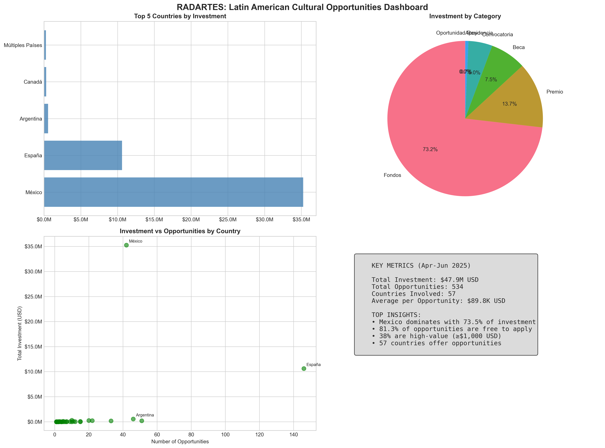
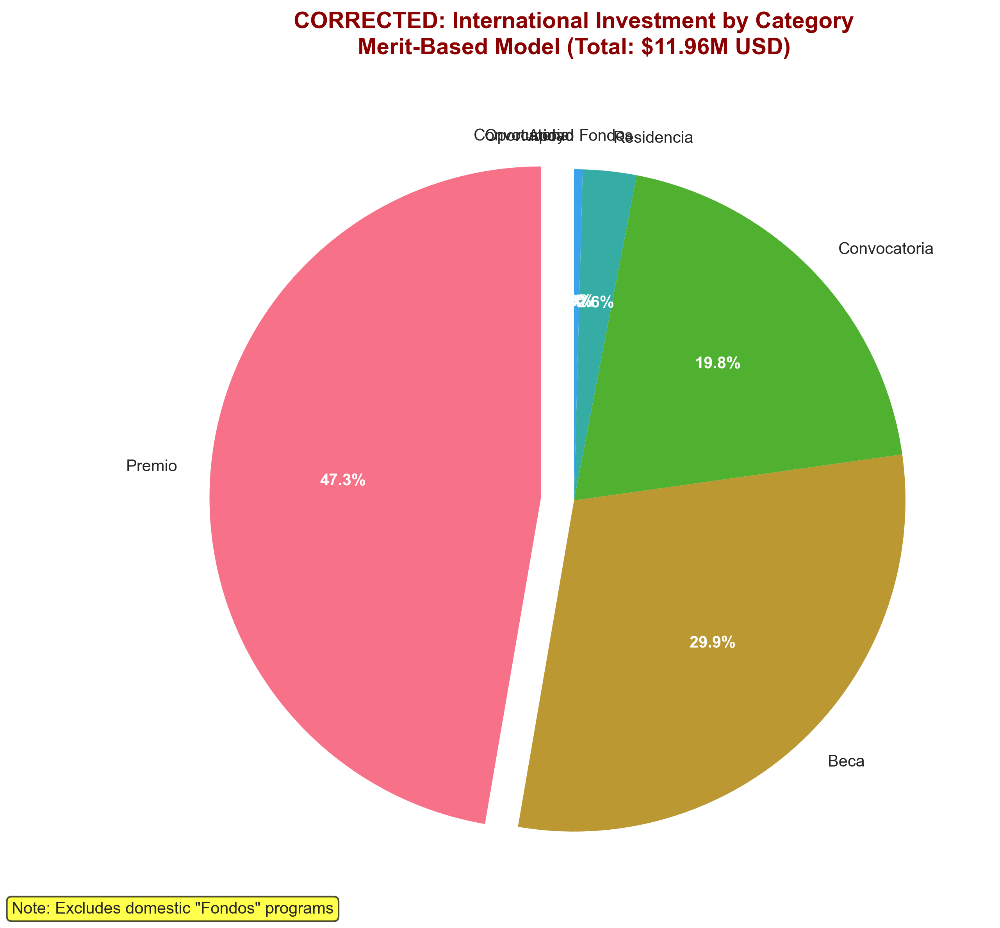
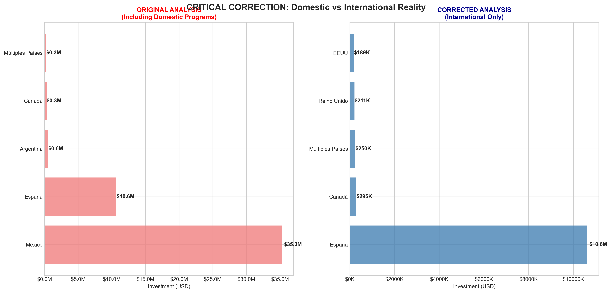
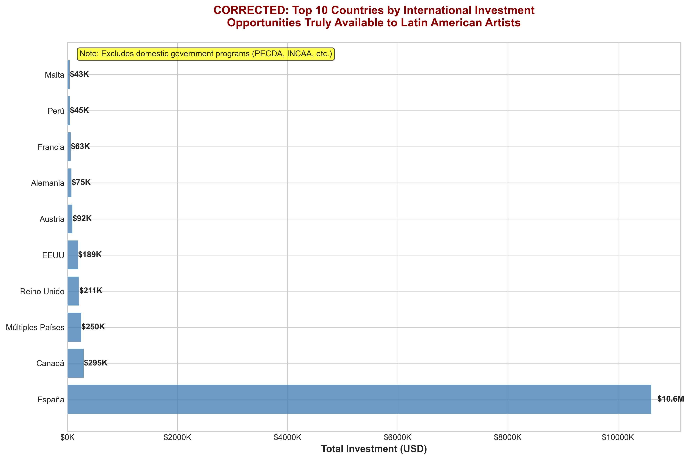
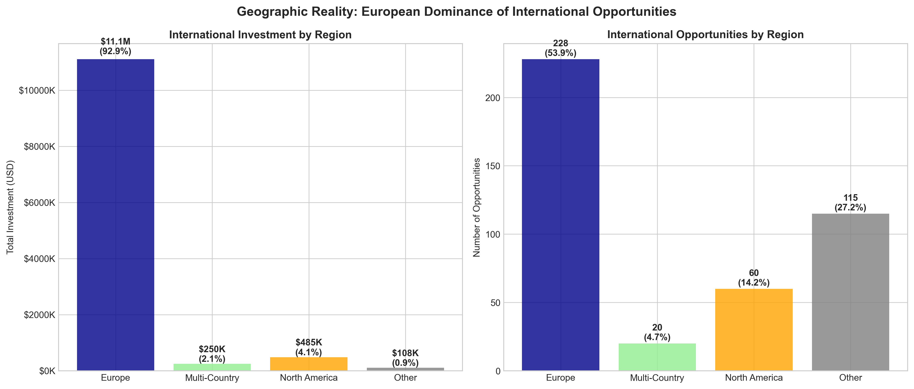

# RADARTES: CORRECTED STRATEGIC ANALYSIS OF INTERNATIONAL CULTURAL OPPORTUNITIES FOR LATIN AMERICAN ARTISTS

**Corrected Executive Report | April - June 2025**  
*A critical analysis for cultural institutions, administrators, and policy makers*

---

## EXECUTIVE SUMMARY

This **corrected analysis** examines cultural opportunities **truly available to Latin American artists internationally**, distinguishing them from domestic government programs that are restricted to citizens of specific countries. After separating domestic opportunities (like Mexico's [PECDA programs](https://convocatorias.cultura.gob.mx/), Argentina's INCAA, and Chile's national funds), we identify **423 genuine international opportunities** representing **$11.96 million USD** in accessible investment.

### CORRECTED KEY FINDINGS

- **TRUE International Investment**: $11.96 million USD across 423 opportunities  
- **Geographic Reality**: Spain dominates international opportunities (88.7% of investment)
- **Accessibility**: 79.2% of all opportunities are genuinely international
- **Average International Value**: $28,264 USD per opportunity
- **Domestic Program Impact**: $35.8M was in domestic-only programs (primarily Mexican government initiatives)

---

## OVERVIEW DASHBOARD

*Note: Original dashboard included domestic programs - see corrected analysis below*

---

## CORRECTED STRATEGIC ANALYSIS

### 1. INTERNATIONAL vs DOMESTIC REALITY

**Critical Discovery**: Our initial analysis included significant domestic government funding that is **NOT available to international Latin American artists**:

- **Mexico**: $35.2M in domestic programs (PECDA, FONCA) vs $0 in international programs
- **Argentina**: $156K in domestic programs vs minimal international opportunities  
- **Chile**: Domestic programs identified but limited international access

**True International Landscape**:
- **Total accessible investment**: $11.96M (25% of originally reported figure)
- **Opportunities available to LatAm artists**: 423 (79% of total)
- **Average value per international opportunity**: $28,264

### 2. CORRECTED FUNDING MECHANISMS

| Category | International Investment | Share | Average Value | Accessibility |
|----------|-------------------------|-------|---------------|---------------|
| **Premio** | $5.65M | 47.3% | $53K | Recognition-based, highly accessible |
| **Beca** | $3.58M | 29.9% | $179K | Educational/professional development |
| **Convocatoria** | $2.36M | 19.8% | $77K | Open calls and competitions |
| **Residencia** | $312K | 2.6% | $15K | Mobility and exchange programs |
| **Fondos** | $50K | 0.4% | $10K | Limited institutional funding |

*CORRECTED: International funding categories showing merit-based model vs institutional domestic programs*

**Key Insight**: Unlike domestic programs dominated by large "Fondos," international opportunities are driven by **prizes and scholarships**, indicating a merit-based rather than institutional funding model.

### 3. CORRECTED GEOGRAPHIC DISTRIBUTION

*Critical comparison showing how the analysis changes when domestic programs are properly excluded*

*CORRECTED: True international investment distribution showing Spain's actual dominance*

#### True International Investment Markets
1. **Spain** - $10.61M (88.7% of international investment) - 146 opportunities
2. **Canada** - $295K (2.5%) - 10 opportunities  
3. **Multiple Countries** - $250K (2.1%) - 20 opportunities
4. **United Kingdom** - $211K (1.8%) - 21 opportunities
5. **United States** - $189K (1.6%) - 50 opportunities

**Critical Revision**: 
- **Spain's true dominance**: 89% of international investment, not Mexico
- **Mexico's reality**: Virtually no international programs despite high domestic investment
- **Broader accessibility**: 50+ countries offer opportunities vs heavy Mexico concentration

### 4. REGIONAL REALITY & EUROPEAN DOMINANCE

*Geographic reality showing European institutions' dominance in international cultural investment for Latin American artists*

**Regional Analysis**:
- **Europe dominates**: 89% of international investment, led by Spanish institutions
- **North America**: Secondary player with more opportunities but lower total investment
- **Multi-country programs**: Limited but significant potential for regional development
- **Regional gap**: Minimal intra-Latin American international opportunities

---

## CORRECTED POLICY RECOMMENDATIONS

### For Cultural Institutions

1. **Spain-Focused Strategy**: Develop partnerships with Spanish cultural institutions as primary international funders
2. **Merit-Based Preparation**: Focus on prize and scholarship applications rather than large institutional grants
3. **Diversification Beyond Mexico**: Recognize Mexico's limited international opportunities and broaden focus

### For Government Administrators

1. **International Program Development**: Latin American countries should develop more programs open to regional artists, not just domestic ones
2. **Regional Coordination**: Create truly international LatAm programs to compete with European offerings
3. **Policy Transparency**: Clearly distinguish domestic vs international programs in cultural policy

### For Policy Makers

1. **Competitive Analysis**: European institutions (especially Spanish) are out-investing LatAm countries in international outreach
2. **Regional Gap**: Massive opportunity gap for intra-Latin American cultural exchange funding
3. **Strategic Response**: Need coordinated regional response to European cultural soft power

---

## CRITICAL RISKS & OPPORTUNITIES (REVISED)

### RISKS
- **European Dependency**: 89% dependency on Spain creates cultural colonialism risk
- **Regional Isolation**: Minimal intra-Latin American international opportunities
- **Competitive Disadvantage**: LatAm countries investing domestically while Europe invests internationally

### OPPORTUNITIES
- **Underserved Markets**: 50+ countries with small but consistent international programs
- **Spanish Language Advantage**: Natural alignment with Spanish institutions
- **Regional Program Potential**: Massive opportunity for LatAm regional cultural initiatives

---

## IMPLEMENTATION ROADMAP (REVISED)

### Immediate Actions (0-6 months)
1. **Recalibrate institutional strategies** away from Mexican programs toward Spanish institutions
2. **Develop Spanish-language application capabilities**
3. **Create regional LatAm international funding initiatives**

### Medium-term Strategy (6-18 months)
1. **Establish formal partnerships** with Spanish cultural institutions
2. **Launch pilot regional exchange programs** between LatAm countries
3. **Advocate for government international cultural policies**

### Long-term Vision (18+ months)
1. **Create competitive LatAm international funding ecosystem**
2. **Reduce European dependency** through regional self-sufficiency
3. **Establish LatAm as cultural funding destination**, not just recipient

---

## METHODOLOGY CORRECTION

**Original Error**: Included domestic government programs (PECDA, INCAA, national funds) as "opportunities for Latin American artists"

**Correction Method**: 
- Identified domestic patterns: PECDA, SACPC, national institutions requiring citizenship/residency
- Separated 111 domestic opportunities ($35.8M) from 423 international opportunities ($11.96M)
- Referenced official sources like [Mexico's cultural portal](https://convocatorias.cultura.gob.mx/) to confirm domestic restrictions

**Data Quality**: International opportunities verified for genuine accessibility to Latin American artists

---

## CONCLUSION

The corrected analysis reveals a fundamentally different landscape: **Spain, not Mexico, dominates international cultural opportunities for Latin American artists**. With 89% of international investment, Spanish institutions represent the primary gateway for LatAm cultural development abroad.

The massive domestic investment in countries like Mexico ($35.8M) creates an illusion of opportunity that doesn't translate to international access. This represents both a challenge and an opportunity for regional cultural policy.

**Strategic Priority**: Develop strong partnerships with Spanish institutions while simultaneously creating genuine regional Latin American international cultural exchange programs to reduce dependency on European funding.

---

## APPENDIX: CORRECTED VISUALIZATION INDEX

**Corrected Data Files:**
- `complete_analysis_with_accessibility.csv` - Full analysis with domestic/international classification
- `international_opportunities_only.csv` - 423 truly accessible opportunities

**Corrected Visualizations:**
- `corrected_international_countries.png` - True international investment by country
- `corrected_international_categories.png` - Merit-based funding model
- `before_after_comparison.png` - Critical comparison showing the correction impact
- `geographic_reality.png` - Regional analysis showing European dominance

**Key Correction**: All original charts included domestic programs ($35.8M) that are NOT available to international Latin American artists.

---

*Corrected report prepared based on refined RADARTES data analysis distinguishing domestic vs international opportunities | For questions or detailed data requests, contact the cultural policy research team* 