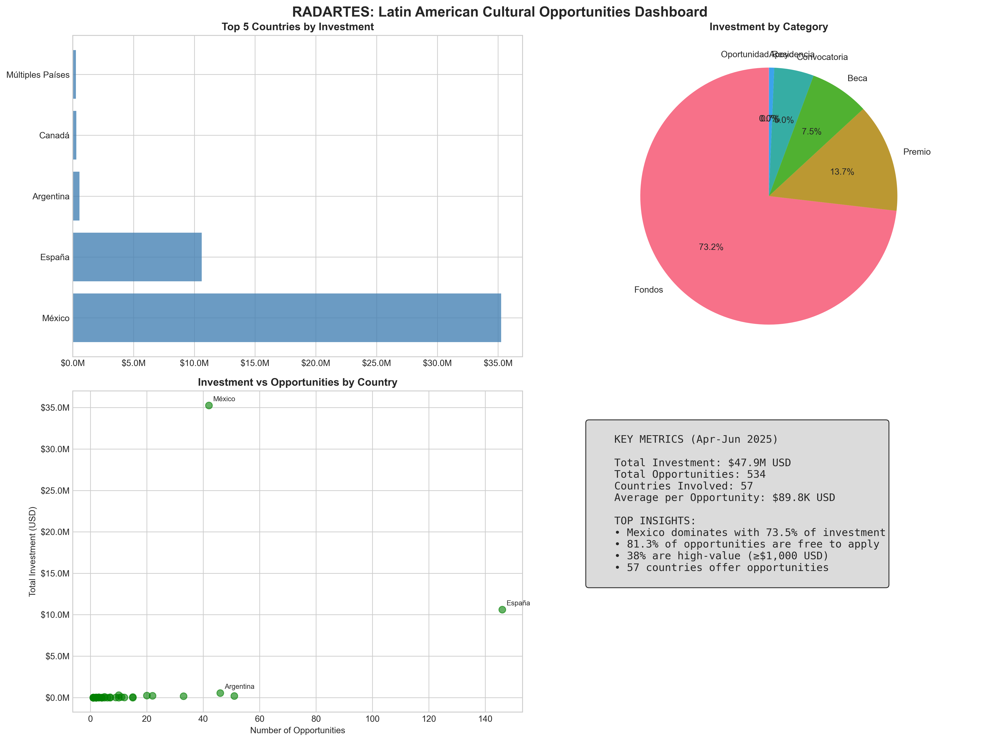
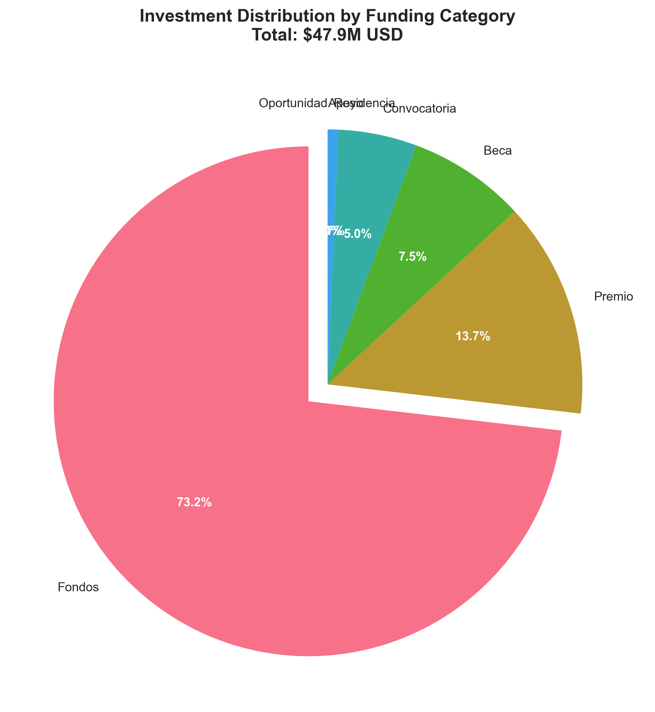
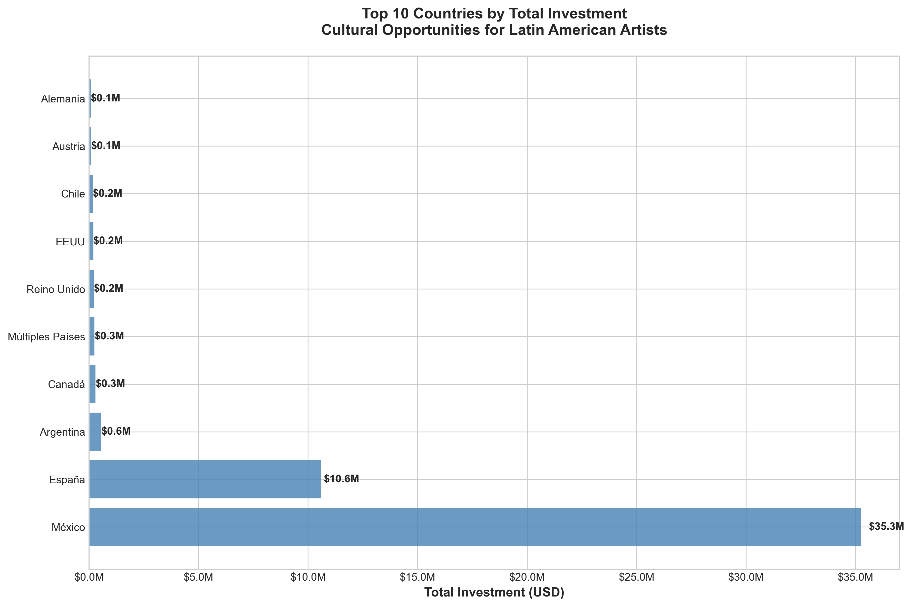
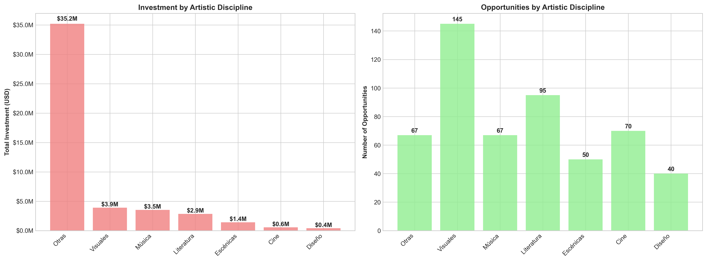
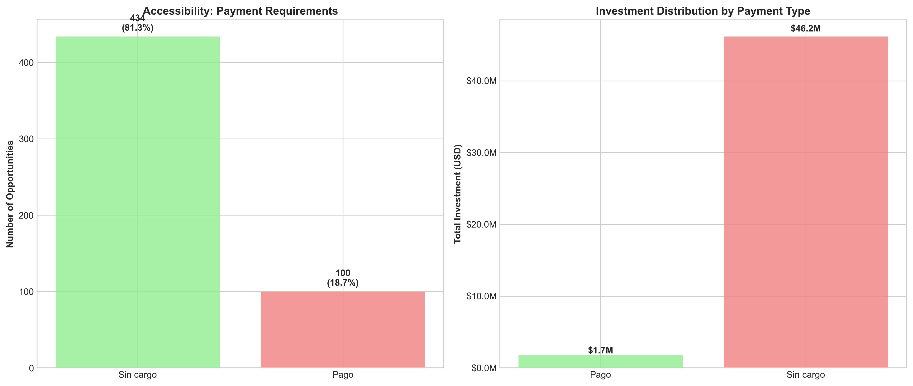

# RADARTES: STRATEGIC ANALYSIS OF CULTURAL OPPORTUNITIES FOR LATIN AMERICAN ARTISTS

**Executive Report | April - June 2025**  
*A critical analysis for cultural institutions, administrators, and policy makers*

---

## EXECUTIVE SUMMARY

This analysis examines 534 cultural opportunities specifically targeting Latin American artists across 57 countries, representing nearly **$48 million USD** in total investment during a three-month period. The findings reveal significant strategic insights about the global cultural funding landscape and highlight both opportunities and structural challenges facing Latin American artists.

### KEY FINDINGS

- **Total Investment**: $47.9 million USD across 534 opportunities
- **Geographic Reach**: 57 countries offering opportunities to LatAm artists
- **Accessibility**: 81.3% of opportunities are free to apply
- **High-Value Concentration**: 38% of opportunities exceed $1,000 USD in value
- **Dominant Markets**: Mexico and Spain account for 95% of total investment

---

## OVERVIEW DASHBOARD

*Complete overview of key metrics and distribution patterns across the cultural opportunities landscape*

---

## STRATEGIC ANALYSIS

### 1. INVESTMENT CONCENTRATION & MARKET DYNAMICS

**Critical Finding**: The investment landscape is heavily concentrated, with **Mexico alone representing 73.5% of total opportunities value** ($35.2M). This concentration suggests:

- **Policy Implication**: Mexican cultural policies are significantly more resource-intensive for international outreach
- **Risk Factor**: Over-dependence on a single market creates vulnerability for Latin American artists
- **Opportunity**: Other markets show potential for expansion

### 2. FUNDING MECHANISMS

| Category | Investment | Share | Average Value | Strategic Significance |
|----------|------------|-------|---------------|----------------------|
| **Fondos** | $35.1M | 73.2% | $797K | Large-scale institutional funding |
| **Premio** | $6.6M | 13.7% | $41K | Recognition-based incentives |
| **Beca** | $3.6M | 7.5% | $123K | Educational/professional development |
| **Convocatoria** | $2.4M | 5.0% | $12K | Open calls and competitions |
| **Residencia** | $313K | 0.7% | $3.4K | Mobility and exchange programs |

*Investment distribution by funding category showing the dominance of "Fondos" (institutional funding)*

**Strategic Insight**: "Fondos" dominate investment but represent only 8.2% of opportunities, indicating high-value, institutional funding as the primary driver of investment.

### 3. GEOGRAPHIC DISTRIBUTION & ACCESSIBILITY

*Geographic distribution of investment showing Mexico's dominance and Spain's high volume approach*

#### Top Investment Markets
1. **Mexico** - $35.2M (42 opportunities) - Avg: $839K per opportunity
2. **Spain** - $10.6M (146 opportunities) - Avg: $73K per opportunity  
3. **Argentina** - $550K (46 opportunities) - Avg: $12K per opportunity
4. **Canada** - $295K (10 opportunities) - Avg: $30K per opportunity
5. **Multiple Countries** - $250K (20 opportunities) - Avg: $13K per opportunity

**Critical Analysis**: 
- **Mexico's efficiency**: Despite fewer opportunities, Mexico provides highest per-opportunity value
- **Spain's volume**: Offers most opportunities but with moderate individual values
- **Argentina's accessibility**: High opportunity count with reasonable accessibility for regional artists

### 4. ARTISTIC DISCIPLINE INVESTMENT PATTERNS

*Investment and opportunity distribution across artistic disciplines showing the concentration in "Otras" and the broader participation in "Visuales"*

| Discipline | Investment | Opportunities | Avg. Value | Market Share |
|------------|------------|---------------|------------|--------------|
| **Otras** | $35.2M | 67 | $525K | 73.4% |
| **Visuales** | $3.9M | 145 | $27K | 8.2% |
| **Música** | $3.5M | 67 | $53K | 7.4% |
| **Literatura** | $2.9M | 95 | $30K | 6.0% |
| **Escénicas** | $1.4M | 50 | $29K | 3.0% |

**Strategic Observation**: "Otras" (Other disciplines) receives disproportionate funding, suggesting either:
- Large interdisciplinary projects dominate funding
- Classification issues in the dataset requiring policy attention
- Emerging artistic practices receiving significant investment

---

## POLICY RECOMMENDATIONS

### For Cultural Institutions

1. **Diversification Strategy**: Reduce dependency on Mexican funding by developing partnerships across multiple countries
2. **Accessibility Enhancement**: Build on the 81.3% free-application rate to maintain low barriers for artists
3. **Value Optimization**: Focus on high-value opportunities (≥$1,000) which represent 38% of opportunities but nearly 100% of meaningful investment

### For Government Administrators

1. **Regional Coordination**: Develop frameworks for multi-country funding initiatives (currently only 3.7% of opportunities)
2. **Investment Efficiency**: Study Mexico's model of high-value, low-volume opportunity creation
3. **Discipline Balance**: Address the concentration in "Otras" category to ensure equitable distribution across artistic disciplines

### For Policy Makers

1. **Market Development**: Encourage funding development in underrepresented markets (54 countries offer <$100K each)
2. **Sustainability Planning**: Create frameworks to reduce volatility from single-country dependency
3. **Data Standardization**: Improve opportunity classification to enable better strategic planning

---

## CRITICAL RISKS & OPPORTUNITIES

### RISKS
- **Geographic Concentration**: 73% dependency on Mexico creates systemic vulnerability
- **Discipline Imbalance**: "Otras" category monopolizes funding, potentially limiting specialized artistic development
- **Market Gaps**: 33 countries offer fewer than 5 opportunities each

### OPPORTUNITIES
- **Untapped Markets**: 54 countries represent potential expansion areas
- **High Accessibility**: 81% free applications provide foundation for inclusive growth
- **Premium Segment**: 203 high-value opportunities demonstrate substantial institutional commitment

*Payment structure analysis showing the high accessibility of opportunities (81% free) and the investment distribution between free and paid opportunities*

---

## IMPLEMENTATION ROADMAP

### Immediate Actions (0-6 months)
1. Establish monitoring systems for investment concentration risks
2. Develop partnerships with underrepresented funding countries
3. Create discipline-specific funding frameworks

### Medium-term Strategy (6-18 months)
1. Launch multi-country collaborative funding initiatives
2. Implement artist mobility enhancement programs
3. Establish investment diversification targets

### Long-term Vision (18+ months)
1. Create sustainable, distributed funding ecosystem
2. Achieve 50% reduction in single-country dependency
3. Establish regional funding coordination mechanisms

---

## METHODOLOGY & DATA QUALITY

**Dataset**: 534 opportunities across April-June 2025  
**Coverage**: 57 countries, 7 artistic disciplines  
**Investment Calculation**: Normalized to USD, with "Residencia" valued at $3,500 USD as specified  
**Data Sources**: Web-scraped and manually cleaned datasets with human verification

**Limitations**: 
- Three-month snapshot may not reflect annual patterns
- "Otras" category requires further classification refinement
- Exchange rate fluctuations may affect USD valuations

---

## CONCLUSION

The Latin American cultural opportunity landscape reveals both extraordinary potential and structural vulnerabilities. With nearly $48 million in quarterly investment, the sector demonstrates significant institutional commitment. However, the extreme concentration in Mexican funding creates sustainability risks that require immediate policy attention.

The high accessibility rate (81% free applications) and substantial high-value opportunity segment (38% > $1,000) provide strong foundations for strategic development. Success will depend on diversifying geographic funding sources while maintaining the current accessibility and value standards.

**Strategic Priority**: Transform the current Mexico-dependent model into a resilient, multi-country ecosystem that preserves investment levels while reducing concentration risk.

---

## APPENDIX: VISUALIZATION INDEX

All charts and visualizations in this report were generated from the comprehensive analysis of 534 cultural opportunities. The following files are available for presentations and further analysis:

- **dashboard_summary.png** - Complete overview dashboard with key metrics
- **top_countries_investment.png** - Geographic investment distribution
- **category_distribution.png** - Funding type breakdown  
- **discipline_analysis.png** - Artistic discipline comparison
- **accessibility_analysis.png** - Payment requirement analysis

**Data Tables Available:**
- analysis_by_country.csv - Complete country-level breakdown
- analysis_by_category.csv - Funding type analysis
- analysis_by_discipline.csv - Artistic discipline analysis  
- high_value_opportunities.csv - Premium opportunities (≥$1,000)

---

*Report prepared based on RADARTES data analysis | For questions or detailed data requests, contact the cultural policy research team* 